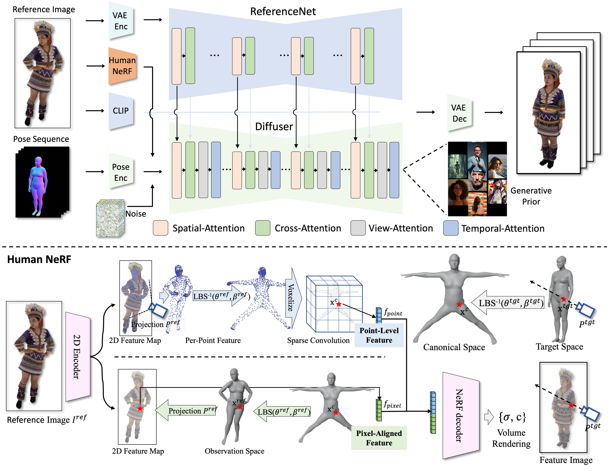

<h1 align='Center'>HumanGif: Single-View Human Diffusion with Generative Prior</h1>

<div align='Center'>
    <a href="https://skhu101.github.io" target="_blank">Shoukang Hu<sup>1</sup></a>;
    <a href="https://scholar.google.com/citations?user=D3h3NxwAAAAJ&hl=en" target="_blank">Takuya Narihira<sup>1</sup></a>;
    <a href="https://ai.sony/people/Kazumi-Fukuda/" target="_blank">Kazumi Fukuda<sup>1</sup></a>;
    <a href="https://ai.sony/people/Ryosuke-Sawata/" target="_blank">Ryosuke Sawata<sup>1</sup></a>;
    <a href="https://ai.sony/people/Takashi-Shibuya/" target="_blank">Takashi Shibuya<sup>1</sup></a>;
    <a href="https://www.yukimitsufuji.com/" target="_blank">Yuki Mitsufuji<sup>1,2</sup></a>

</div>
<div align='Center'>
    <sup>1</sup>Sony AI <sup>2</sup>Sony Group Corporation
</div>

<div align='Center'>
    <a href='https://arxiv.org/pdf/2502.12080'></a>
    <a href='https://github.com/skhu101/HumanGif'></a>
    <a href='https://huggingface.co/Sony/humangif'></a>
</div>

# Framework



# News

- **`2025/02/27`**: 🌟🌟🌟Training and Inference source code released.

# Installation

- System requirement: Ubuntu22.04, Cuda 12.1
- Tested GPUs: H100

Create conda environment:

```bash
  conda create -n humangif python=3.10
  conda activate humangif
```

Install packages with `pip`

```bash
  conda install pytorch==2.2.2 torchvision==0.17.2 torchaudio==2.2.2 pytorch-cuda=12.1 -c pytorch -c nvidia
  pip install -r requirements.txt
```

## Download pretrained models

You can easily get all pretrained models required by inference from our [HuggingFace repo](https://huggingface.co/Sony/humangif).

Clone the the pretrained models into `${PROJECT_ROOT}/pretrained_models` directory by cmd below:
```shell
git lfs install
git clone https://huggingface.co/Sony/humangif
```

Or you can download them separately from their source repo:
   - [HumanGif ckpts](https://huggingface.co/Sony/humangif):  Consist of denoising UNet, guidance encoders, Reference UNet, and motion module.
   - [StableDiffusion V1.5](https://huggingface.co/runwayml/stable-diffusion-v1-5): Initialized and fine-tuned from Stable-Diffusion-v1-2. (*Thanks to runwayml*)
   - [sd-vae-ft-mse](https://huggingface.co/stabilityai/sd-vae-ft-mse): Weights are intended to be used with the diffusers library. (*Thanks to stablilityai*)
   - [image_encoder](https://huggingface.co/lambdalabs/sd-image-variations-diffusers/tree/main/image_encoder): Fine-tuned from CompVis/stable-diffusion-v1-4-original to accept CLIP image embedding rather than text embeddings. (*Thanks to lambdalabs*)

Finally, these pretrained models should be organized as follows:

```text
./pretrained_models/
|-- humangif
    |-- RenderPeople
        |-- stage1_w_normal_w_nerf_guid_w_img_loss/saved_models/
            |-- guidance_encoder_normal-140000.pth
            |-- guidance_encoder_nerf-140000.pth
            |-- NeRF_renderer-140000.pth
            |-- reference_unet-140000.pth
            |-- denoising_unet-140000.pth
        |-- stage2_w_normal_w_nerf_guid_w_img_loss_w_view_attention/saved_models/
            |-- view_module.pth
        |-- stage3_w_normal_w_nerf_guid_w_img_loss_w_view_attention_w_motion_attention/saved_models/
            |-- motion_module.pth
    |-- DNA_Rendering
        |-- stage1_w_normal_w_nerf_guid_w_img_loss/saved_models/
            |-- guidance_encoder_normal-150000.pth
            |-- guidance_encoder_nerf-150000.pth
            |-- NeRF_renderer-150000.pth
            |-- reference_unet-150000.pth
            |-- denoising_unet-150000.pth
        |-- stage2_w_normal_w_nerf_guid_w_img_loss_w_view_attention/saved_models/
            |-- view_module.pth
        |-- stage3_w_normal_w_nerf_guid_w_img_loss_w_view_attention_w_motion_attention/saved_models/
            |-- motion_module.pth
|-- image_encoder
|   |-- config.json
|   `-- pytorch_model.bin
|-- sd-vae-ft-mse
|   |-- config.json
|   |-- diffusion_pytorch_model.bin
|   `-- diffusion_pytorch_model.safetensors
`-- stable-diffusion-v1-5
    |-- feature_extractor
    |   `-- preprocessor_config.json
    |-- model_index.json
    |-- unet
    |   |-- config.json
    |   `-- diffusion_pytorch_model.bin
    `-- v1-inference.yaml
```

## Download SMPL Models
Register and download [SMPL]((https://smpl.is.tue.mpg.de/)) (version 1.0.0) and [SMPLX](https://smpl-x.is.tue.mpg.de/) (version 1.0) models. Put the downloaded models in the folder smpl_models. The folder structure should look like

```
./
├── ...
└── assets/
    ├── SMPL_NEUTRAL.pkl
    ├── SMPL_FEMALE.pkl
    ├── SMPL_MALE.pkl
    ├── models/smplx/
        ├── SMPLX_NEUTRAL.npz
        ├── SMPLX_FEMALE.npz
        ├── SMPLX_MALE.npz
```

# Prepare Datasets

#### RenderPeople Dataset
Please download the rendered multi-view images of RenderPeople dataset from [SHERF](https://github.com/skhu101/SHERF).

Unzip the downloaded dataset under data/ directory and run 
```shell
python data_processing_script/prepare_renderpeople_folder.py
python data_processing_script/prepare_renderpeople_smpl.py --root_dir data/RenderPeople/train -s 0 -e 450
python data_processing_script/prepare_renderpeople_smpl.py --root_dir data/RenderPeople/test -s 450 -e 482
```

Use data processing scripts from [Champ](https://github.com/fudan-generative-vision/champ/blob/master/docs/data_process.md) to render normal images
```shell
python pkgs/pipelines/smpl_pipe_renderpeople.py -i ${HumanGif_folder}/data/RenderPeople/train/ --skip_fit -s 0 -e 450
python pkgs/pipelines/smpl_pipe_renderpeople.py -i ${HumanGif_folder}/data/RenderPeople/test/ --skip_fit -s 450 -e 482
```

The directory structure after data preprocessing should be like this:
```txt
/RenderPeople/train(test)/
|-- subject01/          # A subject data frame
|   |-- camera0000
|       |-- images/       # images frame sequance
|       |-- msk/          # msk frame sequance
|       |-- normal/       # Normal map frame sequance
|   `-- ...
|-- subject02/
|   |-- ...
|   `-- ...
`-- subjectN/
|-- ...
`-- ...
```

#### DNA_Rendering Dataset
Please download DNA-Rendering dataset from [Download](https://dna-rendering.github.io/inner-download.html).

Put the downloaded dataset under data/ directory and run 
```shell
python data_processing_script/prepare_dna_rendering_part_1_smpl.py -s 0 -e 38
python data_processing_script/prepare_dna_rendering_part_2_smpl.py -s 0 -e 389
python data_processing_script/prepare_dna_rendering_folder.py 
```

Use data processing scripts from [Champ](https://github.com/fudan-generative-vision/champ/blob/master/docs/data_process.md) to render normal images
```shell
python pkgs/pipelines/smpl_pipe_dna_rendering.py -i ${HumanGif_folder}/data/DNA_Rendering/Part_1/data_render/ --skip_fit -s 0 -e 38
python pkgs/pipelines/smpl_pipe_dna_rendering.py -i ${HumanGif_folder}/data/DNA_Rendering/Part_2/data_render/ --skip_fit -s 0 -e 389
```

The directory structure after data preprocessing should be like this:
```txt
/DNA_Rendering/train(test)/
|-- subject01/          # A subject data frame
|   |-- camera0000
|       |-- images/       # Normal map frame sequance
|       |-- normal/       # Normal map frame sequance
|   `-- ...
|-- subject02/
|   |-- ...
|   `-- ...
`-- subjectN/
|-- ...
`-- ...
```

Select another small batch of data as the validation set, and modify the `validation.ref_images` and `validation.guidance_folders` roots in training config yaml.

## :running_woman: Inference from checkpoint

### Inference code with RenderPeople dataset
```shell
# Run inference script of novel view
accelerate launch train_s3_RenderPeople_w_nerf_w_img_loss.py --config configs/inference/RenderPeople/stage3_RenderPeople_w_normal_w_nerf_w_img_loss_w_view_module_w_motion_module_nv.yaml

# Run inference script of novel Pose
accelerate launch train_s3_RenderPeople_w_nerf_w_img_loss.py --config configs/inference/RenderPeople/stage3_RenderPeople_w_normal_w_nerf_w_img_loss_w_view_module_w_motion_module_np.yaml
```

### Inference code with DNA_Rendering dataset
```shell
# Run inference script of novel view
accelerate launch train_s3_DNA_Rendering_w_nerf_w_img_loss.py --config configs/inference/DNA_Rendering/stage3_DNA_Rendering_w_normal_w_nerf_w_img_loss_w_view_attention_w_motion_attention_nv.yaml

# Run inference script of novel Pose
python eval_long_video_DNA_Rendering.py --config configs/inference/DNA_Rendering/stage3_DNA_Rendering_w_normal_w_nerf_w_img_loss_w_view_attention_w_motion_attention_np.yaml
```


# Training

### Training code with RenderPeople dataset
```shell
# Run training script of stage1
accelerate launch train_s1_RenderPeople_w_nerf_w_img_loss.py --config configs/train/stage1_RenderPeople_w_normal_w_nerf_w_img_loss.yaml

# Modify the `stage1_ckpt_dir` value in yaml and run training script of stage2
accelerate launch train_s2_RenderPeople_w_nerf_w_img_loss.py --config configs/train/stage2_RenderPeople_w_normal_w_nerf_w_img_loss_w_view_attention.yaml

# Modify the `stage1_ckpt_dir` and `view_module_path` value in yaml and run training script of stage3
accelerate launch train_s3_RenderPeople_w_nerf_w_img_loss.py --config configs/train/stage3_RenderPeople_w_normal_w_nerf_w_img_loss_w_view_attention_w_motion_attention.yaml
```

### Training code with DNA_Rendering dataset
```shell
# Run training script of stage1
accelerate launch train_s1_RenderPeople_w_nerf_w_img_loss.py --config configs/train/stage1_DNA_Rendering_w_normal_w_nerf_w_img_loss.yaml

# Modify the `stage1_ckpt_dir` value in yaml and run training script of stage2
accelerate launch train_s2_RenderPeople_w_nerf_w_img_loss.py --config configs/train/stage2_DNA_Rendering_w_normal_w_nerf_w_img_loss_w_view_attention.yaml

# Modify the `stage1_ckpt_dir` and `view_module_path` value in yaml and run training script of stage3
accelerate launch train_s3_RenderPeople_w_nerf_w_img_loss.py --config configs/train/stage3_DNA_Rendering_w_normal_w_nerf_w_img_loss_w_view_attention_w_motion_attention.yaml
```

# Inference

### Inference code with RenderPeople dataset
```shell
# Run inference script of novel view
accelerate launch train_s3_RenderPeople_w_nerf_w_img_loss.py --config configs/test/RenderPeople/stage3_RenderPeople_w_view_module_w_motion_module_nv.yaml

# Run inference script of novel Pose
accelerate launch train_s3_RenderPeople_w_nerf_w_img_loss.py --config configs/test/RenderPeople/stage3_RenderPeople_w_view_module_w_motion_module_np.yaml
```

### Inference code with DNA_Rendering dataset
```shell
# Run inference script of novel view
accelerate launch train_s3_DNA_Rendering_w_nerf_w_img_loss.py --config configs/test/DNA_Rendering/stage3_DNA_Rendering_w_normal_w_nerf_w_img_loss_w_view_attention_w_motion_attention_nv.yaml

# Run inference script of novel Pose
python eval_long_video_DNA_Rendering --config configs/test/DNA_Rendering/stage3_DNA_Rendering_w_normal_w_nerf_w_img_loss_w_view_attention_w_motion_attention_np.yaml
```

# Evaluation Metric
Follow evaluation scripts from [DISCO](https://github.com/Wangt-CN/DisCo) to calculate metrics
```shell
# Run inference script of novel view
bash gen_eval_nv.sh $folder

# Run inference script of novel Pose
bash gen_eval_nv.sh $folder
```

# Citation

If you find our work useful for your research, please consider citing the paper:

```
```bibtex
@article{hu2025humangif,
  title={HumanGif: Single-View Human Diffusion with Generative Prior},
  author={Hu, Shoukang and Narihira, Takuya and Fukuda, Kazumi and Sawata, Ryosuke and Shibuya, Takashi and Mitsufuji, Yuki},
  journal={arXiv preprint arXiv:2502.12080},
  year={2025}
}
```
